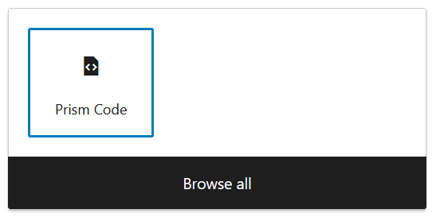
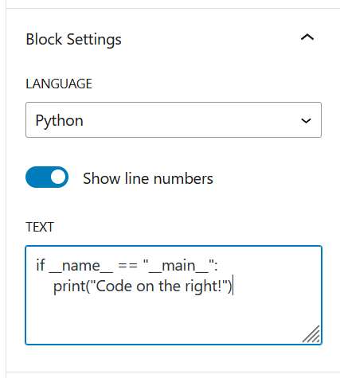
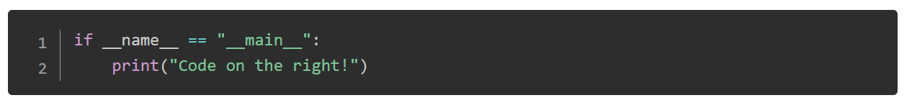

# PrismPress

Version: `1.2.2`

PrismPress is a WordPress plugin that adds a new Gutenberg block for display syntax-highlighted code powered by [Prism.js](https://prismjs.com/index.html).

## Installation

### Option 1, Composer:

[Composer](https://getcomposer.org/) is a PHP package manager. If don't use Composer on your WordPress websites, check out my [wordpress-composer template repo](https://github.com/jmwhitworth/wordpress-composer) for a quick-start.

Add my [personal Composer repository](https://composer.jackwhitworth.com/) to your `composer.json` file:

```json
{
  "repositories": [{
    "type": "composer",
    "url": "https://composer.jackwhitworth.com"
  }]
}
```

Then install the plugin:

```bash
composer require jmwhitworth/prismpress
```

Note: You must ensure that you've configured the plugin install directory in your `composer.json` file. See [this example](https://github.com/jmwhitworth/wordpress-composer/blob/main/composer.json#L12).

### Option 2, manual installation:

On Github, download the package from the latest release. This will be called `PrismPress-x.x.x.zip` (Where `x.x.x` is the version number).

You can then upload this file directly to your WordPress installation and activate the plugin.

Note: Auto-updating isn't configured as of the latest version. To receive updates, you will need to manually install the newest version for future releases. This is planned as an upcoming feature.

## How to use

With the plugin installed and activated, edit a post with the Gutenberg editor.

When adding a new block, you can then select the `Prism Code` block:



All content is added and managed via the 'Block settings' menu on the right-hand side and NOT in the block preview itself. This is due to the way Prism.js rewrites the structure of the markup, editing the text within the block isn't reliable so this resolves that issue.



Final result:



## Prism.js information

Prism.js details:
- Version: `1.29.0`
- Theme:
  - Okaidia
- Language support:
  - Markup (HTML + XML + SVG + MathML + SSML + Atom + RSS)
  - CSS
  - C-like
  - Javascript
  - Bash + Shell
  - JSON
  - Markup templating
  - PHP
  - Python
  - YAML
- Plugins:
  - Show language
  - Toolbar
  - Copy to clipboard
- [Manual download Link for the above configuration](https://prismjs.com/download.html#themes=prism-okaidia&languages=markup+css+clike+javascript+bash+json+markup-templating+php+python&plugins=line-numbers+show-language+toolbar+copy-to-clipboard)

## Todo

- Add updating within WordPress
- Add better text area for adding code (modal?)